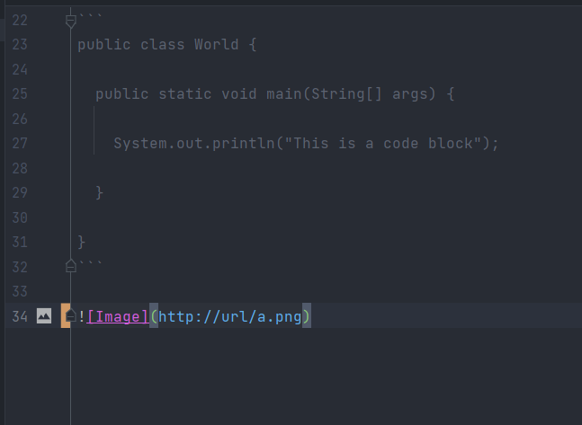

# Basic Formatting

## Sub Heading

*Italic*
**Bold**

> Blockquote Here

* List Item 1
* List Item 2
* List Item 3

Horizontal Rule Below
---

Inlined Code:
`System.out.println("Hello there");`

Code Block:

```
public class World {
  
  public static void main(String[] args) {
  
    System.out.println("This is a code block");
  
  }
  
}
```


[Click Over Here](https://ucsd-cse15l-w22.github.io/week/week2/#week-2-lab-report)